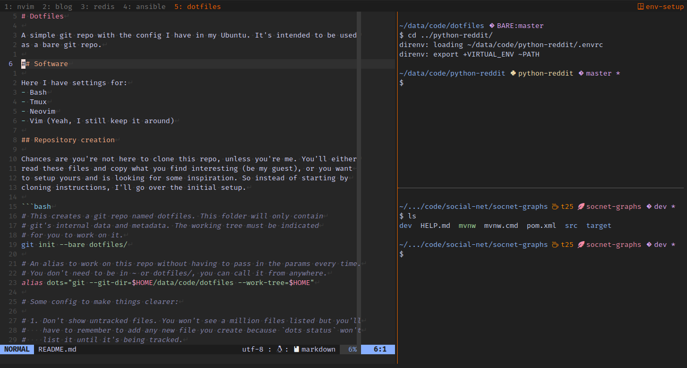

# Dotfiles

A simple git repo with the config I have in my Ubuntu. It's just a bare git repo,
no extra setup.



## Software

Here I have settings for:
- Bash
- Tmux
- Neovim
- Vim (yeah, I still keep it around)

## Repository creation

Chances are you're not here to clone this repo, unless you're me. You'll either
read these files and copy what you find interesting (be my guest), or you want
to setup yours and is looking for some inspiration. So instead of starting by
cloning instructions, I'll go over the initial setup.

```bash
# This creates a git repo named dotfiles. This folder will only contain
# git's internal data and metadata. The working tree must be indicated
# for you to work on it.
git init --bare ~/.dotfiles.git

# An alias to work on this repo without having to pass in the params every time.
# You don't need to be in ~ or dotfiles/, you can call it from anywhere. Don't
# forget to add it to your .bashrc
alias dots="git --git-dir=$HOME/.dotfiles.git --work-tree=$HOME"

# Some config to make things clearer:

# 1. Don't show untracked files. You won't see a million files listed but you'll
#    have to remember to add any new file you create because `dots status` won't
#    list it until it's being tracked.
dots config --local status.showUntrackedFiles no

# 2. Show files relative to the working dir, not the current dir.
#    You won't see lots of ../../.. but you'll have to remember the
#    files may not actually be in the same folder as you are. You
#    have to add $HOME or ~ to the path, e.g. `dots add ~/.bashrc`
dots config --local status.relativePaths no
```

## Usage

Using this git repo is as easy as just using your new alias `dots`, with the
added convenience that you can run it from anywhere in your filesystem, not
only inside your repo folder (since the alias indicates the repo path and the
work-tree path).

```bash
dots status
dots add ~/.bashrc
dots commit -m "Changes to .bashrc"
```

## Cloning

If you're feeling adventurous (or if you're me) you may want to clone the repo.
You can clone as usual, in which case you'll have a folder with all these files
inside, or you can clone a bare repo and use `$HOME` as your work tree as intended.

After cloning as a bare repo you'll have to populate the work tree with the HEAD
revision. A `dots reset` should do the trick.

> [!WARNING]
> Watch out for any existing file! Using your `$HOME` as a working tree makes
> git see any existing files as modified, and a reset will overwrite their
> contents. Make sure that's what you want, or backup your files.

```bash
git clone --bare git@github.com:raphaelnova/dotfiles $HOME/.dotfiles.git

alias dots="git --git-dir=\"$HOME/.dotfiles.git\" --work-tree=$HOME"
dots config --local status.showUntrackedFiles no
dots config --local status.relativePaths no

# This will show any existing file as modified and any missing file as deleted
dots status

# Resetting will discard these "modifications" and "restore" the files
dots reset
```

